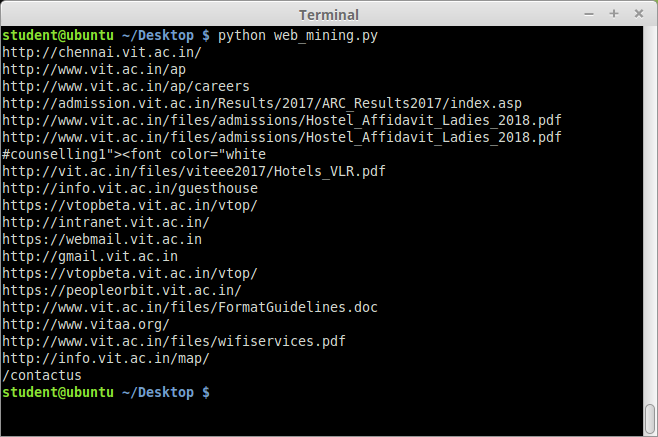
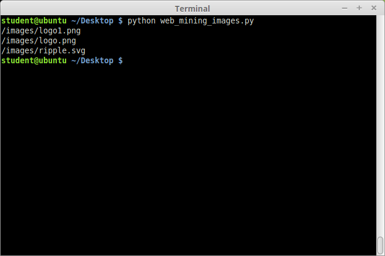

# WEEK 1 - Using request module and regex

## Available programs:

* _web_mining.py_ - Displays all the links present in the specified root URL - "http://www.vit.ac.in"
* _web_mining_images.py_ - Displays the src of all the images present in the root URL - "http://www.vit.ac.in"

### Output of web_mining.py


### Output of web_mining_images.py


__*Also the output of the programs are stored in the text file named: web_mining_links.txt and web_mining_images.txt*__

### To run the codes, run the following command on the terminal opened at the current directory

```bash
python web_mining.py
python web_mining_images.py
```