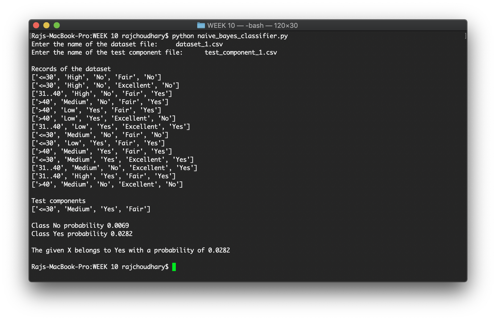
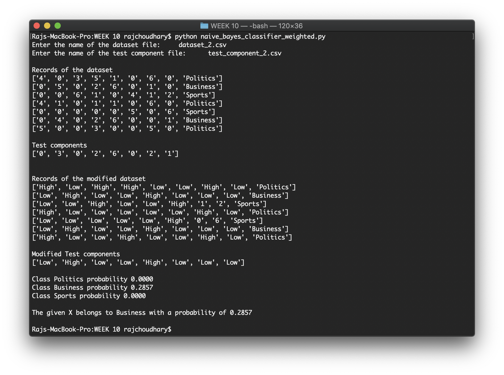

# WEEK 10 - Implementing Naïve Bayes Classifier

## Available programs:

* _naive_bayes_classifier.py_ - This program takes as input a categorical dataset and classifies the test dataset using Naïve Bayes Classification algorithm.
* _naive_bayes_classifier_weighted.py_ - This program takes as input a continuous dataset and first of all it converts it into a categorical dataset and classifies the test dataset using the Naïve Bayes Classification algorithm.

## Available files:

* _assignment.pdf_ - Contains the questions used to check the above two codes.
* _dataset_1.csv_ - Training dataset for the 1st question.
* _test_component_1.csv_ - Test dataset for the 1st question.
* _dataset_2.csv_ - Training dataset for the 2nd question.
* _test_component_2.csv_ - Test dataset for the 2nd question.

## Sample output:

**Question 1:**


**Question 2:**


### To run the codes, run the following command on the terminal opened at the current directory

```bash
python naive_bayes_classifier.py
python naive_bayes_classifier_weighted.py
```