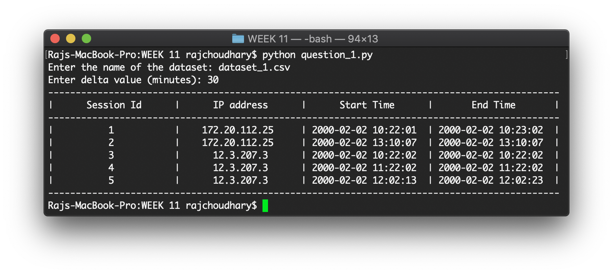
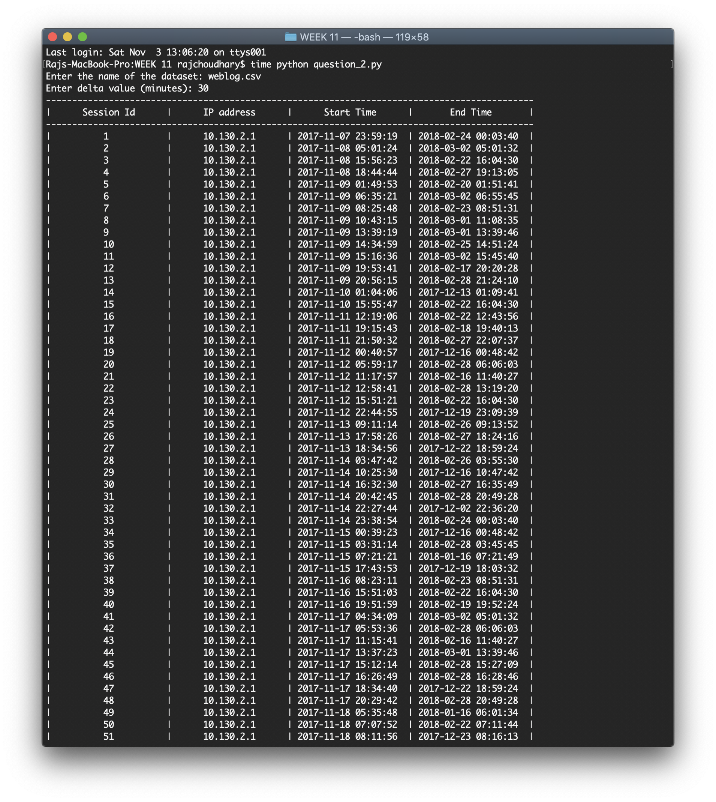

# WEEK 11 - Sessionization of web server log

<p style = "color: skyblue;">The performance of the algorithms could be improved by using some other sorting algorithm. Currently Selection Sort is used as the sorting algorithm.</p>

## Availible programs:

* _question_1.py_ - Program to perform the sessionization of the server log of question 1 in **assignment.pdf**
* _question_2.py_ - Program to perform the sessionization of the server log of question 2 in **assignment.pdf**

## Available files:

* _assignment.pdf_ - Contains the questions for the lab session.
* _dataset_1.csv_ - Dataset for question 1.
* _weblog.csv_ - Dataset for question 2.

## Sample output:

**Question 1:**


**Question 2:**


### To run the codes, run the following command on the terminal opened at the current directory

```bash
python question_1.py
python question_2.py
```