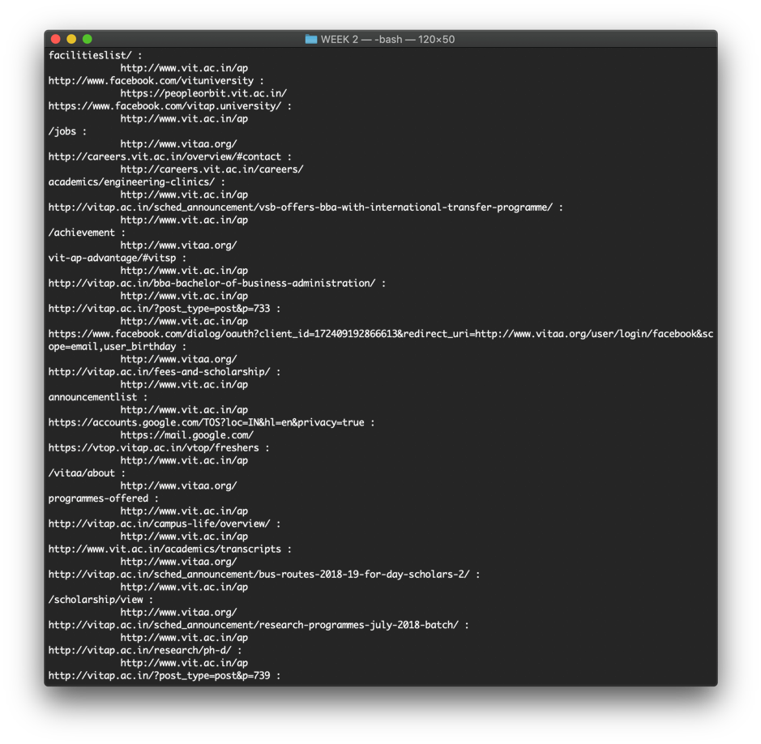

# WEEK 2 - Using request and BeautifulSoup modules

## Available program:

* link_referrer.py - Displays all the link present in the hierarchy of the root URL - "http://www.vit.ac.in" and the referrer to them as a sub-list

### Output of link_referre.py


### To run the codes, run the following command on the terminal opened at the current directory

```bash
python link_referrer.py
```