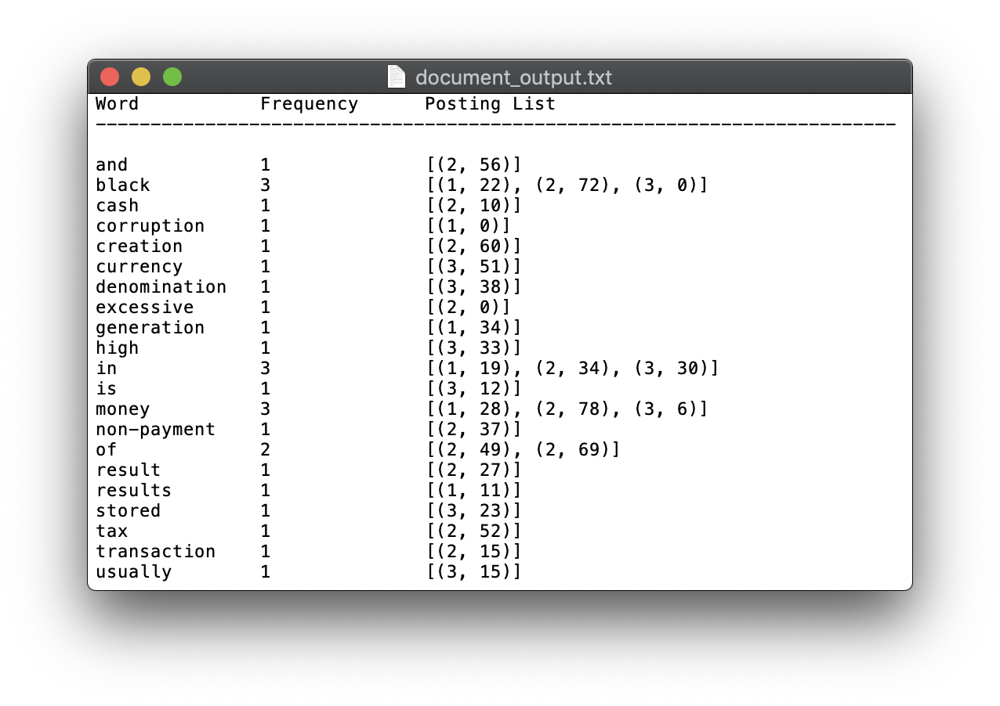

# WEEK 3 - Creating Inverted Index Table

## Available programs:

* _document_inverted_index.py_ - creates an inverted index table from the contents of file input1.txt, input2.txt and input3.txt and saves the output to file document_output.txt
* _website_inverted_index.py_ - downloads the content of the links specidied in the code using request and BeautifulSoup and creates an inverted index table and save the same to the file website_output.txt
* _website_inverted_index_with_stemming_ - does the same as the above programs but before creating inverted index table it performs Porter Stemming on the words and saves the output in the file website_output_stemming.txt

### Format of output:

Word | Frequency | Posting
---- | --------- | -------
word | count | (source#, offset in source)

### Sample output:


### To run the codes, run the following command on the terminal opened at the current directory

```bash
python document_inverted_index.py
python website_inverted_index.py
python website_inverted_index_with_stemming.py
```