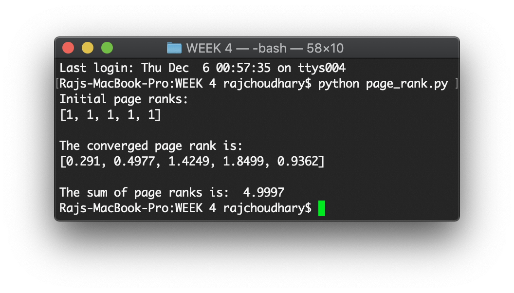
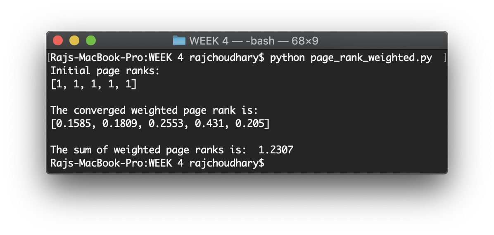

# WEEK 4 - PageRank and Weighted PageRank algorithm

## Available programs:

* _page_rank.py_ - Program that implements the original Google PageRank algorithm and shows the converged page ranks of the individuals webpages in the graph
* _page_rank_weighted.py_ - Program that implements the Weighted PageRank algorithm as described in **assignment.docx** to show the converged page ranks of the webpages in the graph.

## Format of graph used in the program:

Webpage | Outlinks
------- | --------
A | B, C, D
B | A, C, D
C | D
D | C, E
E | B, C, D

## Sample output:



### To run the codes, run the following command on the terminal opened at the current directory

```bash
python page_rank.py
python page_rank_weighted.py
```