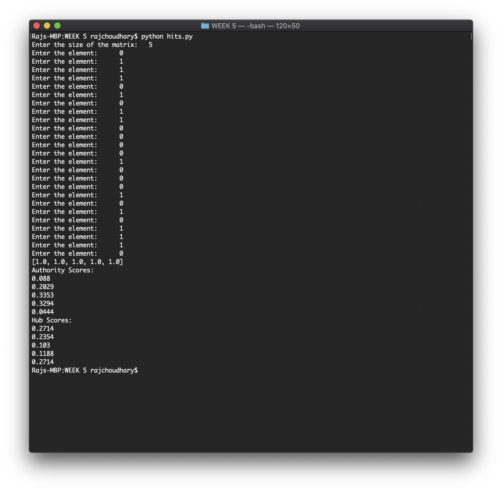
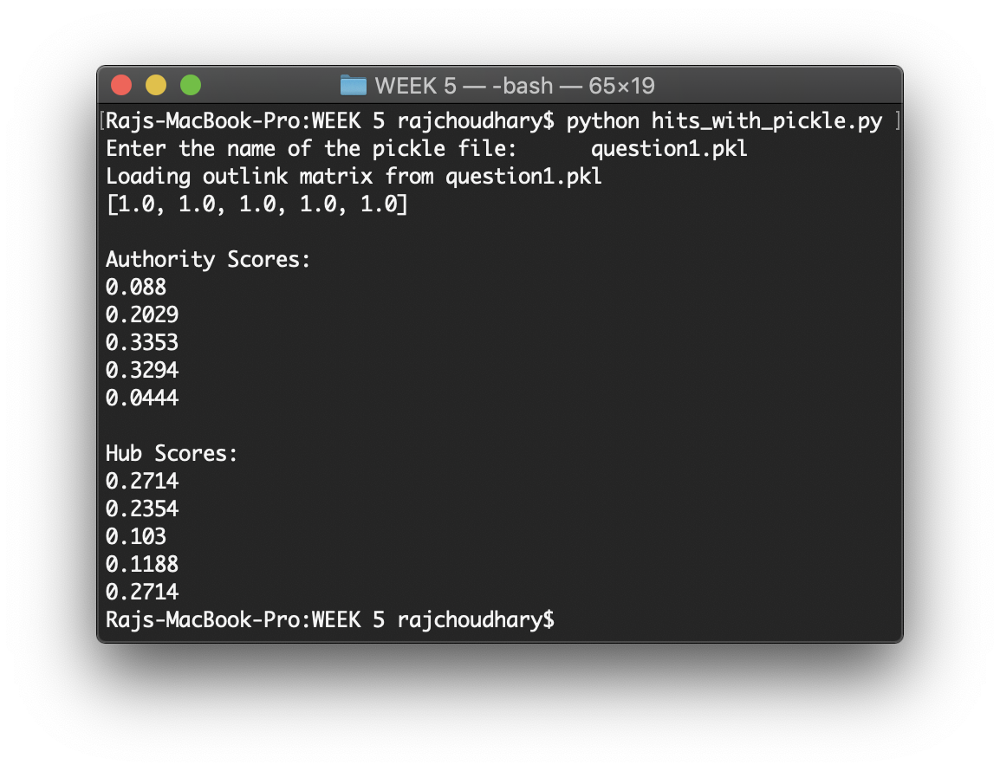

# WEEK 5 - Implementing HITS algorithm to find the authority and hub scores

## Available programs:

* _hits_without_pickle.py_ - The program calculates the authority and hub score for each node of the adjacency matrix as given as input by the user. Here the user will have to supply the input for each run of the code.
* _hits_with_pickle.py_ - This code  also calculates the hub and authority scores of all the nodes but provides the user with the option to load the adjacency matrix from a pickle object file. If the pickle file doesn't exist, then the user is asked to supply the input and the input is then stored in the pickle file for future use.

**2 sample graphs for the problem is there in the assignment pdf and the corresponding pickle files are _question1.pkl_ and _question2.pkl_**

## Sample output:




### To run the codes, run the following command on the terminal opened at the current directory

```bash
python hits_without_pickle.py
python hits_with_pickle.py
```