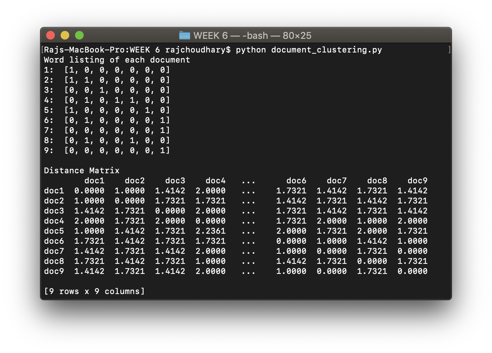
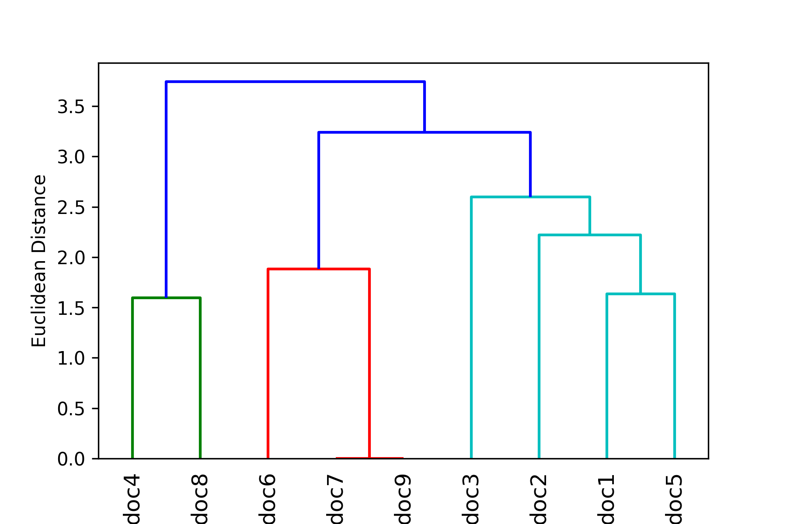
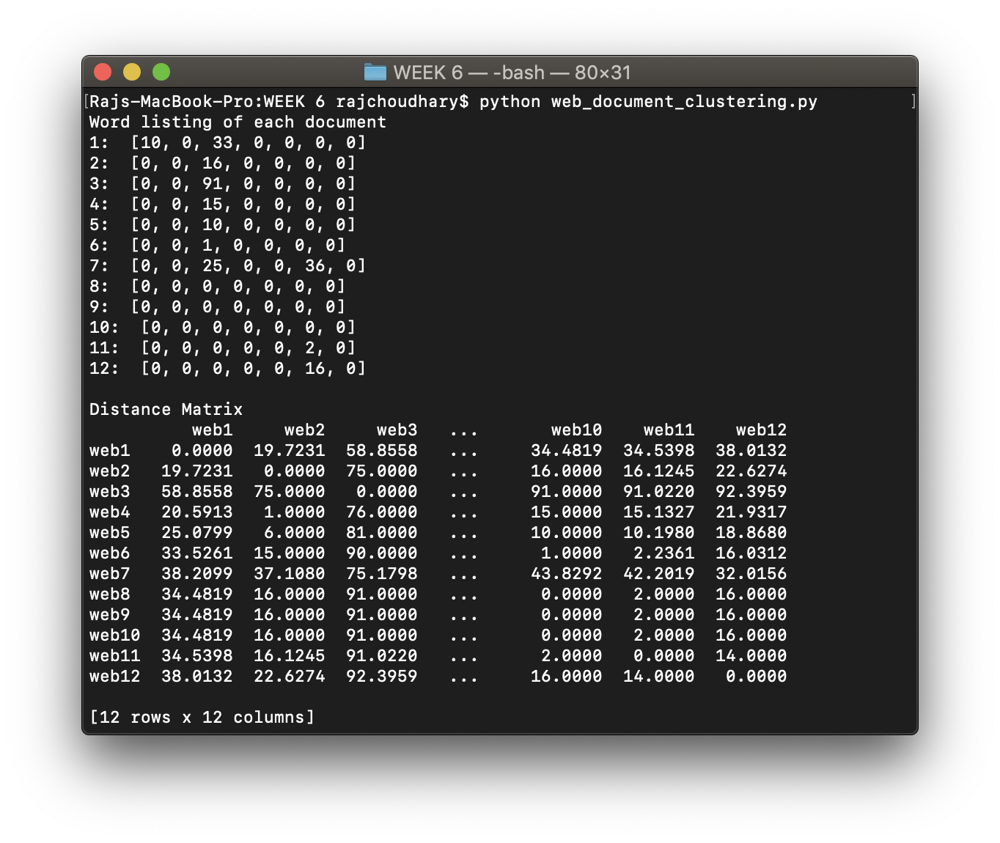
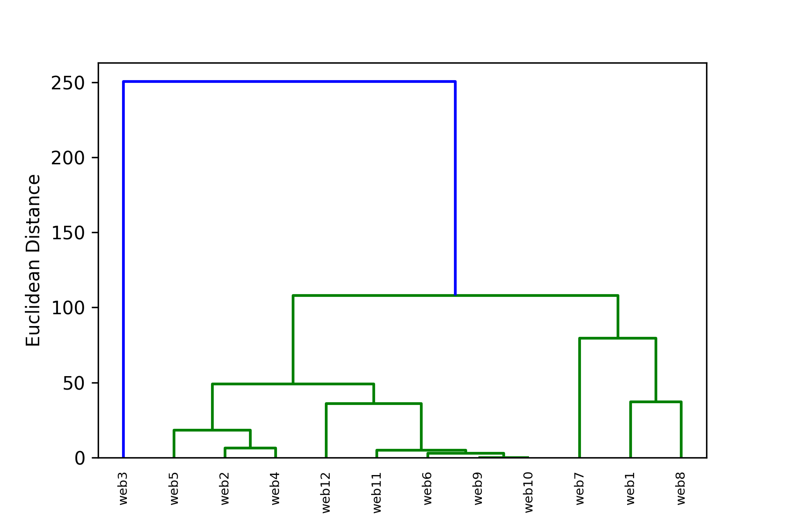

# WEEK 6 - Hierarchical Clustering of documents

**_Euclidean distance is used as distance metric_**
## Available programs:

* _document_clustering.py_ - This program reads all the documents from the __documents__ folder as specified in the file dictionary. Then it creates a vector space model from it, using the word list as specified in the code. After creating the vector space model, the distance matrix is formed and the same is used to perform Hierarchical clustering.
* _web_document_clustering.py_ - This program does the same as the above code but instead of using pre-downloaded files, it scrapes contents from websites as specified in the dictionary.

## Sample output:
**Document clustering**



**Web content clustering**



### To run the codes, run the following command on the terminal opened at the current directory

```bash
python document_clustering.py
python web_document_clustering.py
```