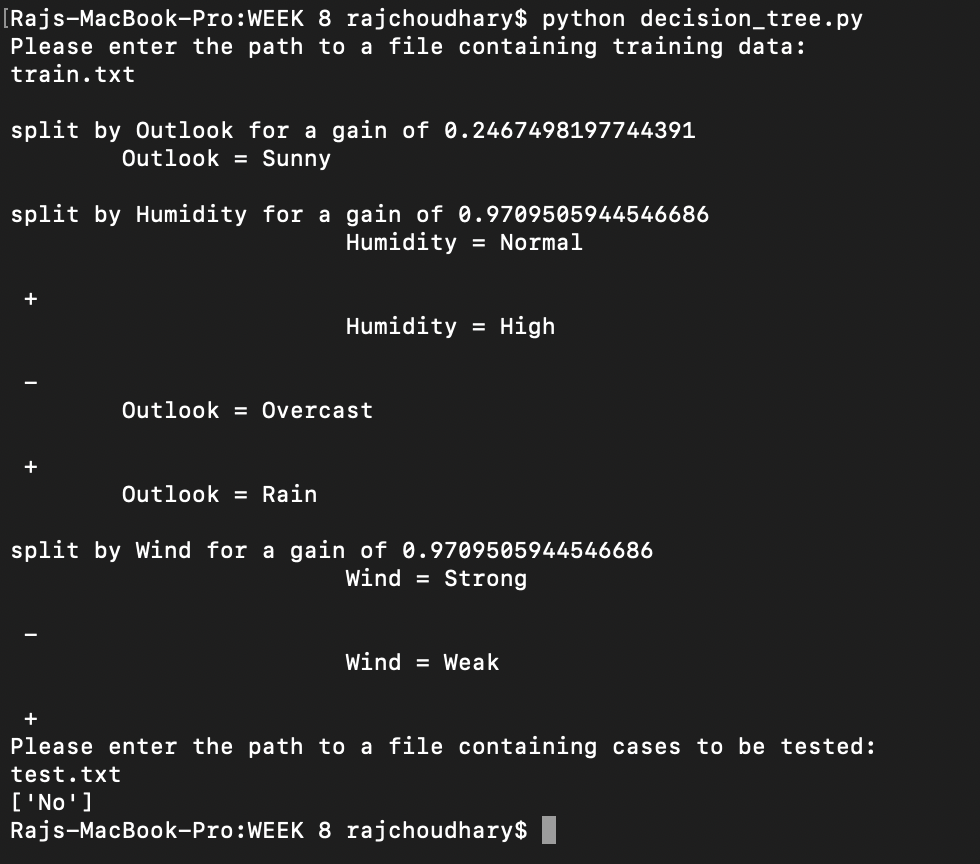

# WEEK 8 - Implementing Decision Tree algorithm

## Available programs:

* _decision_tree.py_ - This program takes in the train.txt as input and then perform ID3 algorithm on it to decide on set of rules for the proper classification of the test data. Then the derieved decision rules are used for classifying the input from test.txt

## Sample output:


### To run the codes, run the following command on the terminal opened at the current directory

```bash
python decision_tree.py
```